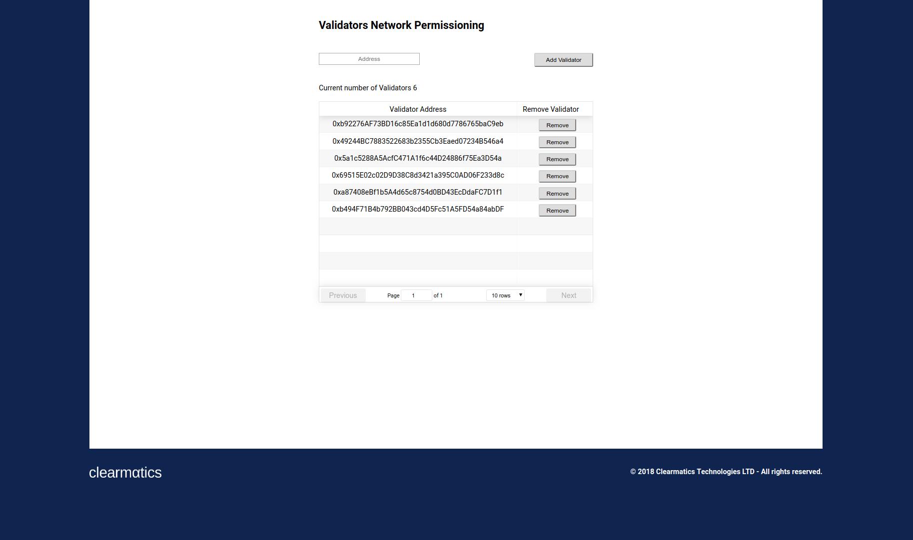

## Validator Dapp on the live network Autonity network

### To run the application

Clone the repo

- install [Metamask](https://metamask.io/) and create an account
- press the icon of the current network name and choose Custom RPC
- add http://34.243.204.94:30005 to the new RPC URL field and press Save
- npm install
- npm start

Please note: MetaMask is having issues running on Firefox. This bug was reported back in August and we're awaiting a fix. Until then please use Chrome.

The frontend will load on http://localhost:3000/

### Validator: General

A network needs at least four validators to function properly and the Autonity network needs a deployed governance contract. The validator governance is based on the [Soma contract](https://docs.autonity.io/network-perm/soma.html).

The Validator DApp has many similarities with how the [Observer DApp](https://github.com/clearmatics/observer-dapp/tree/master) is implemented and their underlying smart contracts. The Observer is based on a P2P permissioning contract ([Glienicke](https://docs.autonity.io/network-perm/glienicke.html)) while the Validator contract is aimed to govern validators.

The similarities and differences of these two network permissioning contracts can be summarised as follows:
#### Similarities
* Both are smart-contract based permission contracts with functions to add and remove nodes
* Both implement an interface which makes it possible to use a custom protocol
* Both implement an interface which allows or denies a peer connection to a network
#### Differences
* Glienicke is the initial permissioning for a peer to participate and interact with a network
* Soma is permissioning for peers to participate in the consensus mechanism
* An observer node (in the Glienicke set) isn't necessary a validator (in the Soma set) but a validator is always an observer (if a node is in the Soma set it is also in the Glienicke set)

### Validator: Main components

The main two functions are: (1) add a Validator and (2) remove an existing Validator. In both cases, the identifier used is the enode address. These are found in `Validators.js`. By utilising either function, Metamask is triggered and brings the user to the payment window.

In the validator contract (Soma.json), the network address can be found. Note that the network addresses for the Observer and Validator DApp are distinct.

### Validator: Miscellaneous

Interactions with smart contracts are facilitated with the library _Drizzle_ to make it easer to write DApp UIs. The loading button (and other alternatives) can be found at [loading.io](loading.io).